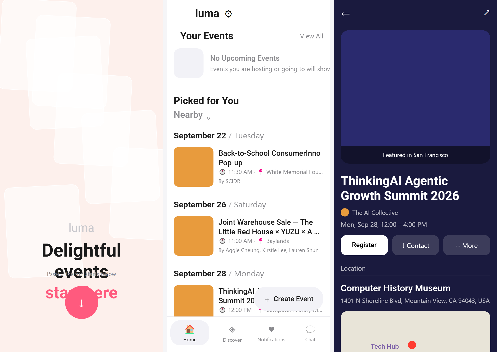

<p align="center">
  <a href="https://luma-ui.edgeone.cool"></a>
</p>

<h1 align="center">Luma UI</h1>

<p align="center">
  <a href="https://luma-ui.edgeone.cool"></a>
</p>

<p align="center">
  A high-fidelity, interactive recreation of Luma's mobile interface — real feed, real detail, real creation flow, running in your browser.<br>
  <a href="#design-notes">Design notes</a> · <a href="#explore-the-prototype">Explore</a> · <a href="#run-locally">Run locally</a> · <a href="#scope-and-limitations">Scope</a> · <a href="https://github.com/migrant620/awesome-app-design-md">More apps →</a>
</p>

---

Created to help people get to know Luma through a hands-on exploration of its interface, and to appreciate the details that make event discovery feel effortless. For the full experience of finding and hosting events, explore [Luma](https://lu.ma).

Explore a dated event feed, a discover rail with category chips, a dark hero detail page painted from the cover, and a creation form with a cover gallery. Content uses demonstration data; it does not connect to a Luma account or host real events.

## Design notes

What makes Luma's interface work, and what this recreation had to get right.

**Start on a gradient, land on white.** The promo wall spends one loud pink-to-amber gradient (`#FF5A7E` → `#FFB84D`) on a single "start here" heading. Once you pass the login sheet, the app drops to pure white with near-black ink — the gradient never returns. This makes the first moment feel special and the daily feed feel calm.

**Events are grouped by day, not by scroll position.** The feed opens with "Your Events" (empty state), then "Picked for You" switches into date-stamped sections — "September 22 / Tuesday", "September 26 / Saturday". The date divider is a bold serif-style heading with a light-grey secondary day name, so you can scan chronologically without a calendar view.

**Cards are cover + type, no chrome.** Each event row puts a rounded square cover on the left, then event name, a meta line with clock and pin icons, and the host name in muted grey. There is no card border, no shadow, no "RSVP" pill on the row — the register action lives on the detail page.

**The detail page turns dark.** Tapping an event opens a full-bleed hero painted from the cover (this build uses a deep navy placeholder), with a white floating card that brings the title, date, host, location and about sections up. Back and share sit as ghost icons over the dark hero; when you scroll, they become a pinned header.

**One floating action, always.** A "+ Create Event" capsule floats above the bottom tab bar, in the bottom-right of the feed. It is the only persistent CTA outside the four tabs — Home, Discover, Notifications, Chat — and it stays anchored even when the feed scrolls.

**Type hierarchy that works on a phone.** Event names are ~22dp semi-bold, date/meta is ~14dp with muted grey, section headers are ~28dp bold. Roboto does the work across the build; the brand Inter is approximated by a system sans.

## Design system at a glance

<p align="center"></p>

## Explore the prototype

| Area | Things to try |
|---|---|
| Promo | The gradient wall with "start here" → login sheet (Continue with Phone). |
| Home feed | Date-grouped events, "Your Events" empty state, Picked for You. |
| Discover | Popular rail and category icon grid (All, Talks, Social, Workshop, Music, Outdoor, Tech). |
| Detail | Dark hero, host line, location section, about text, ghost Contact/More buttons. |
| Create | Event name, date/time, category chips, cover gallery, Register action. |
| Notifications / Chat | Empty states with illustration and descriptive copy. |

### A first walkthrough

1. On the promo wall, tap **start here**, then **Continue with Phone** to land on the home feed.
2. Tap **Back-to-School ConsumerInno Pop-up** to open the dark detail page; scroll to see the pinned back/share header.
3. Tap the **Discover** tab to see the popular rail and category grid.
4. Tap the floating **+ Create Event** capsule to open the creation form.

All content is local demonstration data. No account is created, no event is hosted, and no purchase or subscription occurs.

## Run locally

Use Node.js 18 or newer, with npm.

```bash
npm install
npm run web
```

Open the local URL printed by Expo. Dependency installation requires an internet connection. No Luma credentials or API key are required.

### Build for the web

```bash
npm run typecheck
npm run build:web
```

The static output is written to `dist/`. Serve that directory over HTTP or HTTPS; opening `index.html` directly as a local file is not supported.

## Scope and limitations

- **Mobile layout on the web.** At wider viewport sizes, the interface remains a centred column up to 480 CSS pixels wide. It is not a separate desktop dashboard.
- **Demonstration content.** Event names, hosts, venues and artwork use placeholder data; covers are solid-colour placeholders rather than real photography.
- **Local simulation.** Login, RSVP, hosting, payments and social actions are simulated. No Luma account is created or modified.
- **Validation scope.** Selected flows have been checked in Chromium. This does not establish complete feature coverage, full visual equivalence, Safari/Firefox compatibility, or native Android/iOS acceptance.

## Commission a prototype

Have an app whose screens you want to put in front of your team, a client or investors? I recreate chosen app interfaces and flows as high-fidelity, interactive prototypes and hand over the source code. [Open an issue](https://github.com/migrant620/luma-ui/issues/new?title=Prototype%20enquiry) with the app, the flow you need and your timeline.

## License

The prototype's original code and materials are **source-available for noncommercial self-directed study and research only**, under the [M620 Study and Research License](LICENSE). Commercial products, business use, client deliverables, and hosted services are not permitted without a separate written license. Free access does not itself permit commercial use.

This is not an open-source license. Third-party components retain their own licenses.

## Attribution

This is an independent prototype by M620, not an official Luma product and not affiliated with or endorsed by Luma. Third-party names identify the interface being demonstrated.
