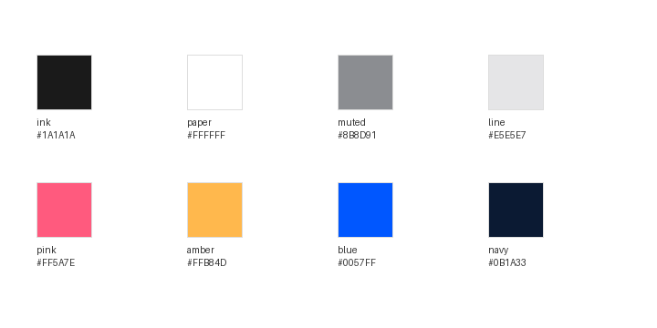

<p align="center">
  <a href="https://luma-ui.edgeone.cool"></a>
</p>

<h1 align="center">Luma UI</h1>

<p align="center">
  <a href="https://luma-ui.edgeone.cool"></a>
</p>

<p align="center">
  A high-fidelity, interactive recreation of the Luma Android app — real components, real navigation and local state, running in your browser.<br>
  <a href="DESIGN.md">DESIGN.md</a> · <a href="#design-notes">Design notes</a> · <a href="#explore-the-prototype">Explore</a> · <a href="#run-locally">Run locally</a> · <a href="#scope-and-limitations">Scope</a> · <a href="https://github.com/migrant620/awesome-app-design-md">More apps →</a>
</p>

---

Created to explore how Luma turns a long list of events into a warm, inviting discovery surface — the frosted welcome wall, the soft brand gradient, the card-driven feed and the calm dark detail page. For the full experience of finding and hosting events, explore [Luma](https://lu.ma).

Everything runs locally in your browser; it does not connect to a Luma account or load any live data.

## Design notes

What makes Luma's interface work, and what this recreation had to get right.

**A welcome wall made of real events.** The first screen is a soft pastel gradient (pink → peach → mint → sky) fading to white, over a scatter of frosted-glass cards. Behind the blurred glass the cards are real event artwork; when the sign-in sheet rises, the artwork resolves. A single round gradient button — pink to orange — carries the whole first action.

**One warm gradient, used only for delight.** The brand gradient runs magenta `#DA60BF` → pink `#F65A90` → orange `#F3AB5A`. It is reserved for the welcome hero ("start here"), the round get-started button and the wordmark sparkle — never for ordinary chrome, which stays neutral white and grey.

**A feed that reads like a calendar.** "Picked for You" is grouped by date, with a quiet grey slash separating the date from the weekday. Each event is a square cover, a host marker, a two-line title and clock / pin metadata — status badges ("Near Capacity", "Waitlist Open") appear only when they matter.

**Detail goes dark.** Tapping an event drops the page into a deep indigo surface (`#0A0922`). The cover sits in a large rounded card, the title and location switch to white, and circular translucent controls (back, share) float over the artwork. The light app and the dark detail page give each other contrast.

**Creation is a stack of soft white cards.** Create Event is a light-grey canvas of rounded white fields — a dashed photo upload well, a timeline that connects the start and end times with a dotted line, pill-shaped date/time chips, and a quiet approval toggle. Nothing is boxed with hard borders.

**Friendly type throughout.** Every label uses Plus Jakarta Sans, the rounded geometric face Luma ships with — large extra-bold screen titles, medium section headings and greys that carry hierarchy through weight rather than colour.

## Design system at a glance

<p align="center"></p>

The full token set — colours, type scale, spacing, radii and component notes — is in [DESIGN.md](DESIGN.md); the values live in [`src/tokens.ts`](src/tokens.ts).

## Explore the prototype

| Area | Things to try |
|---|---|
| Welcome | Tap the round gradient button to raise the sign-in sheet and reveal the event artwork behind the frosted cards. |
| Home | Browse the date-grouped "Picked for You" feed and tap an event to open its detail page. |
| Discover | Switch to Discover for the Popular Events list with Near Capacity / Waitlist Open badges, and browse by category. |
| Detail | View the dark event detail with cover, host, time, action slots and location; use back to return. |
| Create | Tap **Create Event** to open the form — cover well, event name, start/end timeline, location, description and the Require Approval toggle. |
| Notifications / Chat | Visit the empty-state illustrations for the inbox tabs. |

### A first walkthrough

1. On the welcome wall, tap the round pink→orange button.
2. Choose **Continue with Phone** to enter the home feed.
3. Scroll through "Picked for You", then open **Discover** to see popular events and categories.
4. Tap any event to open the dark detail page, then use the back arrow.
5. Tap **Create Event**, inspect the form fields, and toggle **Require Approval**.

Data is static and local to the page; reloading returns you to the welcome wall.

## Run locally

Use Node.js 18 or newer, with npm.

```bash
npm ci --ignore-scripts
npm run web
```

Open the local URL printed by Expo. Dependency installation requires an internet connection. No Luma account or API key is required.

### Build for the web

```bash
npm run typecheck
npm run build:web
```

The static output is written to `dist/`. Serve that directory over HTTP or HTTPS; opening `index.html` directly as a local file is not supported.

## Demo build

The published demo at <https://luma-ui.edgeone.cool> is built from this repository. It was last rebuilt and redeployed on 2026-09-25 (EdgeOne deployment `dp1nju3rwgtg`, source revision `fde0766b`).

## Scope and limitations

- **First batch of screens.** This edition covers the welcome wall, the sign-in sheet, the home feed, Discover, the dark event detail and the create-event form. Notifications and Chat are empty states. Ticketing, guests, calendar and profile flows are not built.
- **Static data.** Events, hosts and artwork are a fixed local set prepared for this study; there is no search, filtering, maps or real host data.
- **Artwork.** Event covers are cropped from reference frames for study only; the profile avatar is a plain gradient. They are not redistributed as promotional assets.
- **Typeface.** The app ships Plus Jakarta Sans under the SIL Open Font License, bundled locally in `assets/fonts/`.
- **Not yet built.** Sign-in authentication, maps, image upload and date/time pickers are visual only; the timeline and toggles do not persist.
- **Mobile layout on the web.** The interface is designed for a phone-width column; on wider screens it stays a centred column.
- **Validation scope.** The first-batch screens have been checked in Chromium at 393 dp width. This does not establish complete feature coverage, full visual equivalence, Safari/Firefox compatibility, or native Android/iOS acceptance.

## Commission a prototype

Have an app whose screens you want to put in front of your team, a client or investors? I recreate chosen app interfaces and flows as high-fidelity, interactive prototypes and hand over the source code. [Open an issue](https://github.com/migrant620/luma-ui/issues/new?title=Prototype%20enquiry) with the app, the flow you need and your timeline.

## License

The prototype's original code and materials are **source-available for noncommercial self-directed study and research only**, under the [M620 Study and Research License](LICENSE). Commercial products, business use, client deliverables, and hosted services are not permitted without a separate written license. Free access does not itself permit commercial use.

This is not an open-source license. Third-party components retain their own licenses.

## Attribution

This is an independent prototype by M620, not an official Luma product and not affiliated with or endorsed by Luma. Third-party names and event artwork identify the interface being demonstrated.

Bundled fonts retain their own licenses: Plus Jakarta Sans under the SIL Open Font License 1.1. See the third-party notices in the build output.
